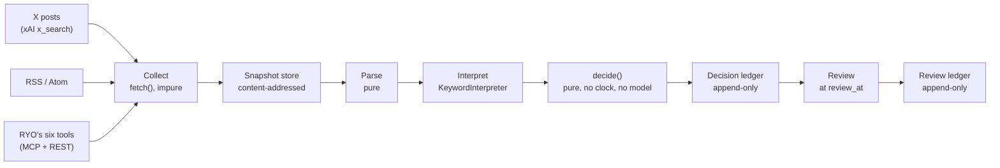
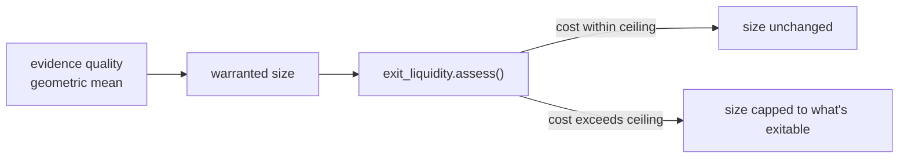

# Architecture

## The one rule

```
fetch()  touches the network, is allowed to fail, and is never deterministic
parse()  touches nothing, and is a pure function of its payload
```

The decision engine only ever sees the output of `parse()`. Because that
function is pure and every payload is stored under the hash of its own bytes,
any past decision can be re-derived from what is on disk and must reach the
same verdict. A network call inside `parse()`, even once, breaks that
guarantee for every decision built from it.

## The pipeline



Everything left of `decide()` may touch the network, a clock, or a model, and
may fail. `decide()` and everything after it reads only recorded arguments:
no clock, no network, no randomness. That is what makes replay a proof
rather than a description.

## Layers, and what each one owns

| Package | Owns | Guarantee |
|---|---|---|
| `hanko/sources` | X via xAI `x_search`, RSS/Atom, fixtures, one adapter contract | `fetch()` may fail; `parse()` is pure |
| `hanko/snapshot` | Append-only, content-addressed store; replay; integrity checking | Altered bytes cannot load silently |
| `hanko/ryotools` | The six RYO tools over MCP and REST; structural fact extraction | Read-only; no write path exists |
| `hanko/decision` | Readings, independence, evidence quality, verdicts, pre-registration | `decide()` is a pure function |
| `hanko/review` | Falsifier checking, calibration, per-voice and per-rule track records | One review per decision, enforced |
| `hanko/skills` | Research skills contributed back to the tool surface, e.g. `exit_liquidity` | Same read-only, honesty-first contract |

## Transport: MCP and REST reach the same facts

The hackathon issues an MCP credential, so MCP is the path known to exist; a
REST client exists too in case a plain HTTP endpoint is published instead.
Both are adapted to the same source contract, so a test asserts that facts
extracted from an MCP payload are byte-identical to facts extracted from a
REST payload for the same data. Swapping transport touches no line of
reasoning code: the six tools, the decision engine, and the review loop
cannot tell which one supplied a number. Full transport detail, including
what a live MCP handshake and a live `x_search` call actually return, is at
[tryhanko.vercel.app/docs](https://tryhanko.vercel.app/docs).

## exit_liquidity, as a size gate

`exit_liquidity` is not just a standalone Track 3 tool. It is also the size
gate `decide()` runs internally before committing to a position, using the
same model rather than a second copy of the arithmetic:



The number the agent sizes a position on and the number the standalone tool
publishes cannot drift apart, because they are the same function call.

## Why decisions engineering choices exist

Fuller write-ups of the choices that mattered, including two real bugs found
and fixed during development, are in [`DECISIONS.md`](DECISIONS.md). What has
not been shown yet (live calibration, a live `ENTER`, a real priced pool) is
in [`LIMITATIONS.md`](LIMITATIONS.md).
